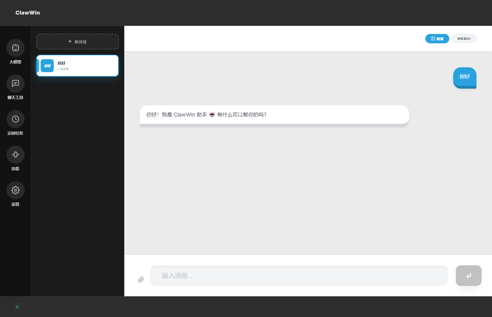
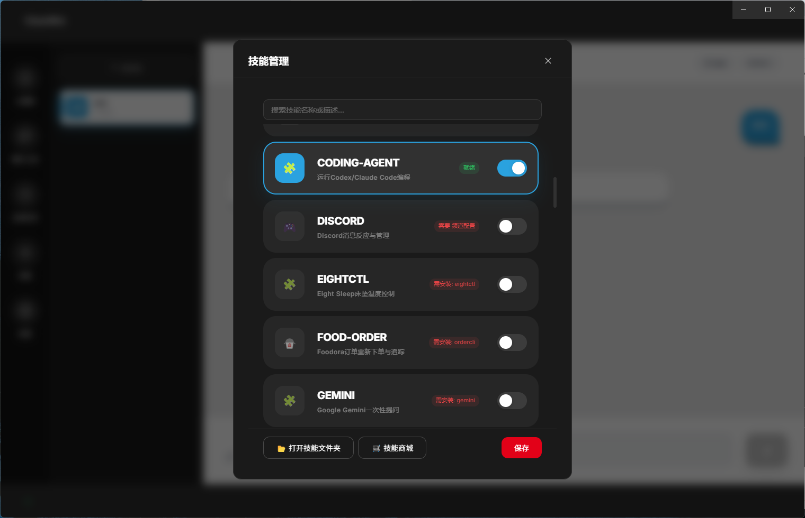
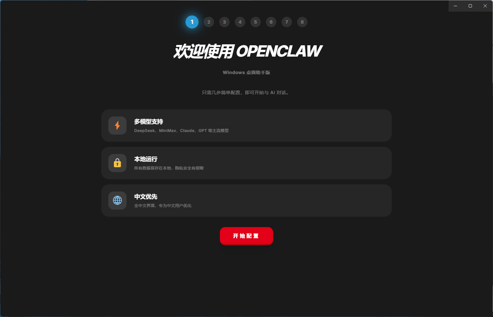

# ClawWin 2.0

**OpenClaw 的 Windows 图形界面版。** 不用敲命令行，双击安装，跟着引导填个 API Key 就能用。

**The Windows GUI for [OpenClaw](https://github.com/nicepkg/openclaw).** No command line needed — just install, enter your API key, and start chatting.

---

## 截图 / Screenshots

| 聊天界面 Chat | 欢迎引导 Welcome |
|:---:|:---:|
|  |  |

| 模型选择 Models | 本地模型 Ollama | 技能管理 Skills |
|:---:|:---:|:---:|
|  |  |  |

---

## 特点 / Features

**中文**

- 🚀 **装了就能用** — 安装引导帮你搞定一切，填 API Key、选模型，三步完成
- 💬 **像聊天软件一样用** — 多会话、流式回复、Markdown 渲染、图片显示
- 🤖 **11 家云端模型** — 智谱、DeepSeek、通义千问、Moonshot、MiniMax、硅基流动、NVIDIA、OpenAI、Claude、Gemini、Grok
- 🏠 **Ollama 本地模型** — 内置 Ollama 管理，一键下载运行本地大模型，无需联网
- 📡 **10 个聊天渠道** — Telegram、Discord、飞书、钉钉、微信（企业微信）、Slack、QQ、WhatsApp、Google Chat、Signal
- 🧩 **技能扩展** — 内置技能市场，一键启用 Coding Agent、食物识别、智能家居等技能
- 🔄 **自动更新** — 启动时检查 GitHub 新版本，应用内下载安装，镜像加速支持
- 📸 **截屏功能** — Ctrl+Alt+A 一键截屏复制到剪贴板
- 📖 **配置教程** — 每个模型和渠道旁都有"教程"按钮，链接官方文档
- 🔒 **数据全在本地** — API Key 和聊天记录都在你自己电脑上，不经过第三方

**English**

- 🚀 **Works out of the box** — setup wizard handles everything: API key, model selection, done in 3 steps
- 💬 **Chat app experience** — multi-session, streaming responses, Markdown rendering, image display
- 🤖 **11 cloud providers** — Zhipu, DeepSeek, Qwen, Moonshot, MiniMax, SiliconFlow, NVIDIA, OpenAI, Claude, Gemini, Grok
- 🏠 **Local models with Ollama** — built-in Ollama management, one-click download and run, no internet needed
- 📡 **10 chat channels** — Telegram, Discord, Feishu/Lark, DingTalk, WeChat Work, Slack, QQ, WhatsApp, Google Chat, Signal
- 🧩 **Skill extensions** — built-in skill marketplace, enable Coding Agent, food recognition, smart home and more
- 🔄 **Auto-update** — checks GitHub for new releases on startup, in-app download and install with mirror acceleration
- 📸 **Screenshot** — Ctrl+Alt+A to capture and copy to clipboard
- 📖 **Tutorial buttons** — every model provider and chat channel has a "Tutorial" button linking to official docs
- 🔒 **Your data stays local** — API keys and chat history live on your machine, never uploaded anywhere

---

## 下载安装 / Download

从 [Releases](https://github.com/wk42worldworld/ClawWin2.0/releases) 下载最新的 `ClawWin-Setup-x.x.x.exe`，双击安装，打开就行。

Download the latest `ClawWin-Setup-x.x.x.exe` from [Releases](https://github.com/wk42worldworld/ClawWin2.0/releases), install, and launch.

## 支持的模型 / Supported Models

| 提供商 Provider | 模型 Models | 备注 Notes |
|---|---|---|
| 智谱 Z.AI | GLM-5, GLM-4 Plus/Flash | 国内直连 |
| DeepSeek | V3, R1 | 国内直连 |
| 通义千问 Qwen | Max, Plus, Turbo, QwQ | 国内直连 |
| Moonshot / Kimi | Kimi K2.5 | 国内直连 |
| MiniMax | M2.1 | 国内直连 |
| 硅基流动 SiliconFlow | DeepSeek V3/R1, Qwen3 | 国内直连 |
| NVIDIA NIM | DeepSeek R1, Llama 3.3, Kimi K2.5 | 国内直连 |
| OpenAI | GPT-5.2, GPT-5.1, o3, o4-mini, GPT-4.1 | 需科学上网 |
| Anthropic | Claude Opus 4.6/4.5, Sonnet 4.5/4, Haiku 4.5 | 需科学上网 |
| Google | Gemini 2.5 Pro/Flash, 2.0 Flash | 需科学上网 |
| xAI | Grok 3, Grok 3 Mini | 需科学上网 |
| Ollama | 任意本地模型 Any local model | 本地运行 |

## 从源码运行 / Build from Source

```bash
git clone https://github.com/wk42worldworld/ClawWin2.0.git
cd ClawWin2.0
npm install
npm run prepare:openclaw
npm run prepare:node
npm run electron:dev
```

打包安装程序 / Build installer:

```bash
npm run build:all
npm run build:installer
# 安装包在 release/ 目录
```

## 常见问题 / FAQ

**Q: 发消息没有回复？**
A: 检查 API Key 是否正确，以及网络能否访问所选模型的 API 地址。

**Q: 支持 macOS / Linux 吗？**
A: 目前只支持 Windows。

**Q: 数据存在哪？**
A: `~/.openclaw/` 目录，全在本地。

---

**Q: No response after sending a message?**
A: Make sure your API key is correct and your network can reach the model provider's API.

**Q: macOS / Linux?**
A: Windows only for now.

**Q: Where is my data?**
A: `~/.openclaw/` on your local machine. Nothing leaves your computer.

## License

MIT
