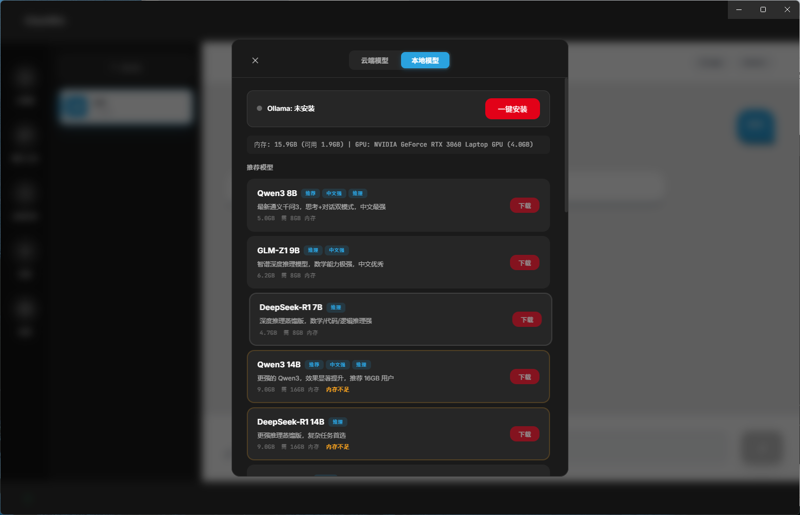
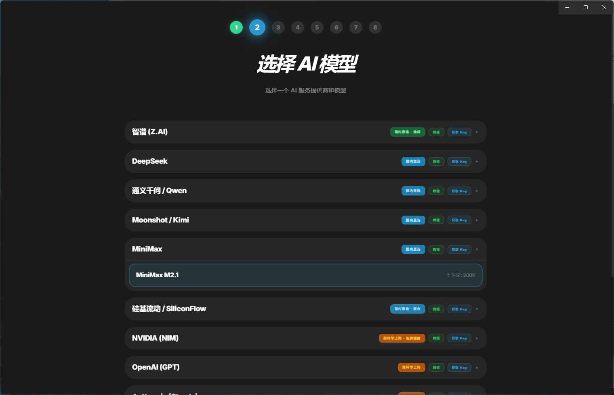

<p align="center">
  
</p>

<h1 align="center">ClawWin</h1>

<p align="center">
  <strong>你的 Windows AI 全能助手</strong><br>
  不用敲命令行，装了就能用。聊天、搜索、画图、写代码、控制浏览器，一个应用全搞定。
</p>

<p align="center">
  <a href="https://github.com/nicepkg/openclaw">基于 OpenClaw</a> ·
  <a href="./README_EN.md">English</a> ·
  <a href="https://github.com/wk42worldworld/ClawWin2.0/releases">下载安装</a>
</p>

<p align="center">
  
  
  
  
</p>

---

## 截图

| 聊天界面 | 安装引导 |
|:---:|:---:|
|  |  |

| 模型选择 | 云端模型 | 技能管理 |
|:---:|:---:|:---:|
|  |  |  |

---

## 为什么选 ClawWin

市面上的 AI 桌面客户端要么只能聊天，要么需要折腾命令行。ClawWin 不一样 — 它把聊天、搜索、创作、自动化全部打包进一个漂亮的桌面应用，三步安装，开箱即用。

---

## 核心能力

### 💬 像微信一样聊天

多会话管理、流式回复、Markdown 渲染、代码高亮、图片显示。你只管打字，剩下的交给 AI。

### 🤖 12 家云端模型 + 本地模型

国内直连智谱、DeepSeek、通义千问、Moonshot、MiniMax、硅基流动、NVIDIA，海外支持 OpenAI、Claude、Gemini、Grok。还有 Ollama 本地模型，断网也能用。

### 🧩 50+ 技能扩展

不只是聊天机器人。ClawWin 内置 50 多个技能，覆盖日常工作的方方面面：

| 类别 | 技能 | 说明 |
|------|------|------|
| 🔍 搜索 | 百度 AI 搜索 | 网页搜索、百科、秒懂百科、AI 智能问答 |
| 🌤️ 生活 | 天气查询 | 全球天气实时查询与多日预报，无需配置 |
| 📰 资讯 | 新闻资讯 | 中文热点新闻 + 全球 AI 技术动态，无需配置 |
| 🗺️ 出行 | 高德地图 | 路线规划、POI 搜索、地理编码 |
| 📧 办公 | 邮件管理 | QQ/163 邮箱收发邮件 |
| 🔎 视觉 | 图片分析 | 智谱 GLM-4V 图片理解、OCR 文字识别 |
| 🎨 创作 | AI 图片生成 | 智谱 CogView 文字生成图片 |
| 🌐 建站 | 网页设计部署 | 生成精美 HTML 页面，一键部署 Cloudflare |
| 🖥️ 自动化 | Windows 控制 | 控制浏览器、桌面自动化、UI 元素操作 |
| 💻 开发 | 编程代理 | 调用 Claude Code / Codex 编程 |
| 🐙 开发 | GitHub | Issue、PR、CI 全流程管理 |

### 📡 10 个聊天渠道

把 AI 接入你常用的聊天工具：Telegram、Discord、飞书、钉钉、企业微信、Slack、QQ、WhatsApp、Google Chat、Signal。一个后端，多端响应。

### 🖥️ 浏览器自动化

内置 Windows Control 技能，通过 UI 自动化直接控制 Chrome/Edge 浏览器 — 读取网页内容、点击按钮、填写表单、截屏分析。让 AI 帮你操作浏览器，解放双手。

### 🔄 自动更新

启动时自动检查新版本，应用内一键下载安装。支持 GitHub 镜像加速，国内也能秒更新。不想被打扰？设置里一键关闭更新提示。

### 🔒 数据全在本地

API Key、聊天记录、技能配置全部存在你自己电脑上（`~/.openclaw/`），不经过任何第三方服务器。你的数据，你做主。

---

## 下载安装

从 [Releases](https://github.com/wk42worldworld/ClawWin2.0/releases) 下载最新的 `ClawWin-Setup-x.x.x.exe`，双击安装，打开就行。

> 安装引导会帮你搞定一切：选模型、填 Key、配技能，三步完成。

---

## 支持的模型

| 提供商 | 模型 | 备注 |
|---|---|---|
| 智谱 Z.AI | GLM-5, GLM-4 Plus/Flash | 国内直连 |
| DeepSeek | V3, R1 | 国内直连 |
| 通义千问 | Max, Plus, Turbo, QwQ | 国内直连 |
| Moonshot / Kimi | Kimi K2.5 | 国内直连 |
| MiniMax | M2.1 | 国内直连 |
| 硅基流动 | DeepSeek V3/R1, Qwen3 | 国内直连 |
| NVIDIA NIM | DeepSeek R1, Llama 3.3, Kimi K2.5 | 国内直连 |
| OpenAI | GPT-5.2, GPT-5.1, o3, o4-mini | 需科学上网 |
| Anthropic | Claude Opus 4.6, Sonnet 4.5, Haiku 4.5 | 需科学上网 |
| Google | Gemini 2.5 Pro/Flash | 需科学上网 |
| xAI | Grok 3, Grok 3 Mini | 需科学上网 |
| Ollama | 任意本地模型 | 本地运行，无需联网 |

---

## 技能配置指南

大部分技能开箱即用，部分需要 API Key：

| 技能 | 需要 | 获取地址 |
|------|------|----------|
| 天气查询 | 无需配置 | — |
| 新闻资讯 | 无需配置 | — |
| 百度搜索 | 百度千帆 API Key | [qianfan.cloud.baidu.com](https://qianfan.cloud.baidu.com/) |
| 高德地图 | 高德 Web 服务 Key | [console.amap.com](https://console.amap.com/) |
| 图片分析 | 智谱 API Key | [open.bigmodel.cn](https://open.bigmodel.cn/) |
| AI 图片生成 | 智谱 API Key | [open.bigmodel.cn](https://open.bigmodel.cn/) |
| 邮件管理 | 邮箱授权码 | [QQ邮箱SMTP设置](https://service.mail.qq.com/detail/0/75) |
| 网页部署 | Cloudflare Token | [dash.cloudflare.com](https://dash.cloudflare.com/profile/api-tokens) |
| Windows 控制 | Python + pyautogui | `pip install pyautogui` |

---

## 从源码构建

```bash
git clone https://github.com/wk42worldworld/ClawWin2.0.git
cd ClawWin2.0
npm install
npm run prepare:openclaw
npm run prepare:node
npm run electron:dev
```

打包安装程序：

```bash
npm run build:all
npm run build:installer
# 安装包在 release/ 目录
```

---

## 常见问题

**Q: 发消息没有回复？**
检查 API Key 是否正确，以及网络能否访问所选模型的 API 地址。国内模型（智谱、DeepSeek 等）无需科学上网。

**Q: 技能显示"不可用"？**
部分技能需要安装额外工具（如 `node`、`python3`、`gh`），查看技能卡片上的提示信息。

**Q: 支持 macOS / Linux 吗？**
目前只支持 Windows。macOS/Linux 用户可以直接使用 [OpenClaw](https://github.com/nicepkg/openclaw) 命令行版。

**Q: 数据存在哪？**
`~/.openclaw/` 目录，全在本地，不上传任何地方。

**Q: 怎么关闭自动更新提示？**
设置 → 版本 → 勾选"禁用自动更新提示"。

---

## 致谢

ClawWin 基于 [OpenClaw](https://github.com/nicepkg/openclaw) 构建，感谢 OpenClaw 社区的贡献。

## License

MIT
